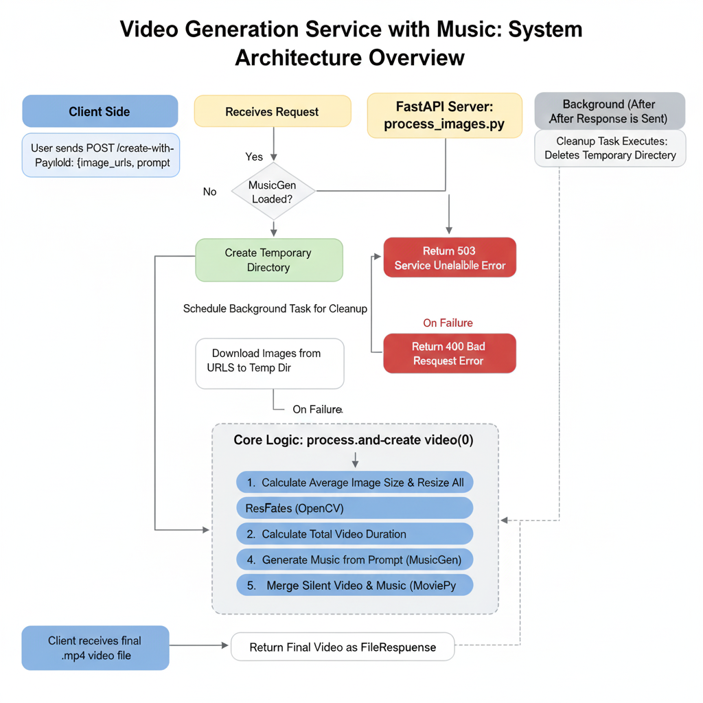

# 🎵 AI-Powered Vlog & Music Generator 📸

<p align="center">
  <a href="https://www.python.org/"></a>
  <a href="https://fastapi.tiangolo.com/"></a>
  <a href="https://pytorch.org/"></a>
  <a href="https://huggingface.co/transformers"></a>
  <a href="https://opencv.org/"></a>
  <a href="https://zulko.github.io/moviepy/"></a>
  <a href="https://www.uvicorn.org/"></a>
</p>

Welcome to the AI-Powered Vlog & Music Generator! This high-performance web service, built with FastAPI, transforms a collection of your photos and a simple text prompt into a beautiful, short video vlog, complete with custom-generated background music.

## ✈️ The Perfect Tool for Travelers

Imagine you've just returned from an amazing trip. You have hundreds of photos, but creating a shareable video is a chore. You need to pick the right photos, find royalty-free music that fits the mood, and wrestle with video editing software.

**This project solves that problem.**

A traveler can simply:

1. Select a handful of their favorite photo URLs.
2. Write a simple prompt describing the vibe of their trip, like `"an upbeat, adventurous electronic track for a mountain hike"` or `"a calm, acoustic lo-fi beat for a relaxing beach day"`.
3. Send a single request to our API.

In moments, they receive a ready-to-share `.mp4` video file with their photos, smooth transitions, and a unique, AI-generated soundtrack. It's the fastest way to turn memories into a shareable story!

---

## ✨ Core Features

- **🤖 AI Music Generation**: Leverages the `facebook/musicgen-small` model from Hugging Face to create unique music from a text prompt.
- **🖼️ Image-to-Video Slideshow**: Automatically creates a video from a list of image URLs.
- **✨ Smooth Transitions**: Implements cross-fade transitions between images for a professional look.
- **🧠 Smart Resizing**: Calculates the average dimensions of all input images and resizes them to create a uniform, consistently-sized video.
- **⚡ High-Performance API**: Built with **FastAPI** for asynchronous, high-speed request handling.
- **🧠 Efficient Model Management**: The AI model is loaded into memory only once on server startup (`lifespan` event), ensuring low latency for all subsequent requests.
- **🧹 Automatic Cleanup**: Uses background tasks to automatically clean up temporary files after a video is generated and sent.

---

## 🧠 The AI Model: A Deep Dive into MusicGen

The creative core of this project is **`facebook/musicgen-small`**, a state-of-the-art generative AI model from Meta AI.

### What is MusicGen?

- **Function**: MusicGen is a text-to-audio model specifically trained to generate high-quality, novel music from textual descriptions (prompts). You give it a phrase like `"a calming lofi hip hop beat"` and it produces a complete audio track.
- **Architecture**: It is a sophisticated transformer-based model. It was trained on a massive dataset of licensed music, enabling it to understand the intricate patterns of melody, rhythm, harmony, and instrumentation associated with different text prompts.

### Why `musicgen-small`?

The MusicGen family is available in several sizes (small, medium, large). The choice of the `small` variant for this project is a deliberate engineering decision that prioritizes accessibility and performance:

- ✅ **Performance**: The smaller model size leads to significantly faster music generation (inference). This is critical for a responsive API, ensuring users get their vlogs quickly.
- ✅ **Resource Efficiency**: `musicgen-small` requires much less VRAM (on GPU) and RAM (on CPU) compared to its larger counterparts. This allows the service to run on a wider range of hardware, including consumer-grade machines, not just expensive cloud instances.
- ✅ **Quality Balance**: While larger models might offer slightly higher fidelity, the `small` model produces excellent quality music that is perfectly suited for social media vlogs and short-form content. It strikes the perfect balance between quality and speed for this application.

### How is it Integrated in the Code?

The model is integrated into the FastAPI application following best practices for production ML services:

1. **Efficient Loading with `lifespan`**: The model is loaded into memory **only once** when the server starts up, using FastAPI's `lifespan` event manager. This avoids the extremely time-consuming process of reloading the multi-gigabyte model for every single API request, resulting in very low latency for users.
2. **High-Level Abstraction**: The code uses the `pipeline` function from the Hugging Face `transformers` library. This provides a simple, high-level interface to the model, handling all the complex tokenization and processing steps behind the scenes.
3. **Dynamic Duration Control**: The length of the generated music is controlled by calculating the required number of output tokens based on the desired duration in seconds (`max_new_tokens = duration * 50`).
4. **Standard Output Format**: The model outputs a raw audio waveform and a sampling rate. The code uses the `scipy` library to save this data into a standard `.wav` file, which is then seamlessly merged with the video using `moviepy`.

This thoughtful integration ensures the service is not only powerful but also robust, scalable, and efficient.

---

## 📊 Application Workflow

This diagram illustrates the end-to-end process for the main vlog generation service (`process_images.py`), from the user's API request to the final video delivery.



---

## � Project Structure & Code Deep Dive

This repository contains two distinct but related FastAPI applications.

### 1. `process_images.py` (The All-in-One Vlog Generator)

This is the main application that provides the end-to-end vlog generation service.

#### Key Components:

* **`lifespan(app: FastAPI)`**: This `asynccontextmanager` is a modern FastAPI feature that manages startup and shutdown events.

  * **On Startup**: It detects if a CUDA-enabled GPU is available, prints the device being used, and crucially, loads the `facebook/musicgen-small` model into a global `model_pipeline` variable. This is a huge performance win, as the multi-gigabyte model is not reloaded for every API call.
  * **On Shutdown**: It cleans up the model and empties the CUDA cache to free up resources.
* **API Endpoint: `POST /create-video-with-music`**:

  * **Input**: Accepts a JSON payload defined by the `VideoRequest` Pydantic model, which requires a list of `image_urls` and a text `prompt` for the music.
  * **Process**:
    1. Creates a temporary directory to work in.
    2. Downloads all images from the provided URLs.
    3. Calls the core `process_and_create_video` function.
    4. Returns the final video as a `FileResponse`.
    5. Uses `BackgroundTasks` to schedule the temporary directory for deletion *after* the response has been sent to the client.
* **Core Logic: `process_and_create_video()`**: This is where the magic happens.

  1. **Image Validation & Sizing**: It iterates through the downloaded images, calculates their average width and height, and resizes all images to this average for a consistent look.
  2. **Video Settings**: Defines constants like `FPS`, `STILL_DURATION_SEC`, and `TRANSITION_DURATION_SEC`. It also enforces a 10-second video limit to manage generation time and resources.
  3. **Silent Video Generation**: Uses `cv2.VideoWriter` (OpenCV) to create a silent `.mp4` file. It writes frames for each still image and then generates intermediate frames for a smooth cross-fade transition to the next image.
  4. **Music Generation**: Calls the `generate_music` helper, passing the user's prompt and the calculated video duration.
  5. **Final Assembly**: Uses the powerful `moviepy` library to merge the silent video (`VideoFileClip`) with the generated audio (`AudioFileClip`), creating the final `final_video.mp4`.
* **Music Helper: `generate_music()`**:

  * This function interfaces directly with the loaded `transformers` pipeline.
  * It sets a random seed to ensure that even if the same prompt is given twice, the music can be different (though it's re-seeded for each call in this implementation).
  * It converts the prompt into audio data and saves it as a `.wav` file using `scipy`.

### 2. `musicgen.py` (Standalone Music Service)

This file defines a separate, more focused FastAPI service dedicated solely to generating music. **It is not used by `process_images.py`** and can be run independently as a standalone microservice.

#### Key Components:

* **API Endpoint: `POST /generate-music/`**:

  * **Input**: Accepts a `MusicRequest` with a `prompt` and a `duration`.
  * **Process**: Instead of making the user wait, it uses `BackgroundTasks` to run the music generation process in the background.
  * **Output**: It immediately returns a JSON response with a `task_id` and the expected file paths, confirming that the task has started. The actual files are saved to the server's disk (`generated_music/` folder).
* **Background Task: `generate_and_save_music()`**:

  * This function is nearly identical to the music generation logic in the other file but is designed to run independently.
  * A key difference is that it generates **two** different music tracks from the same prompt by using different random seeds, providing the user with options.

---

## ⚙️ Setup and Installation

#### 1. Prerequisites

- Python 3.9+
- `pip` and `virtualenv`
- **Recommended**: An NVIDIA GPU with CUDA installed for significantly faster model inference. The code will fall back to CPU if a GPU is not found.

#### 2. Clone the Repository

```bash
git clone https://github.com/your-username/Vlog-generation-facebook-musicgen-model.git
cd Vlog-generation-facebook-musicgen-model
```

#### 3. Set Up a Virtual Environment

```bash
python -m venv venv
source venv/bin/activate
# On Windows, use: venv\Scripts\activate
```

#### 4. Install Dependencies

The project dependencies are listed in the `requirements.txt` file. Install them using pip:

```bash
pip install -r requirements.txt
```

---

## 🚀 Running the Service

To run the main vlog generation service, use `uvicorn`:

```bash
uvicorn process_images:app --host 0.0.0.0 --port 8000
```

The server will start, and you will see logs indicating that the `facebook/musicgen-small` model is being downloaded and loaded. This may take a few minutes on the first run.

---

## 🤖 API Usage Example

You can interact with the API using any HTTP client, like `curl` or Python's `requests` library.

Here is an example using `curl` to create a video.

```bash
curl -X POST http://127.0.0.1:8000/create-video-with-music \
-H "Content-Type: application/json" \
-d '{
  "image_urls": [
    "https://images.unsplash.com/photo-1502602898657-3e91760c0337",
    "https://images.unsplash.com/photo-1522093007474-d86e9bf7ba6f",
    "https://images.unsplash.com/photo-1500313830566-a9933c627e83"
  ],
  "prompt": "A cheerful and romantic accordion melody for a trip to Paris"
}' \
--output my_paris_vlog.mp4
```

### ✅ Expected Outcome

If successful, the command will save a video file named `my_paris_vlog.mp4` in your current directory. This video will feature the three images from Paris with transitions and a custom soundtrack based on your prompt.

---

## 🔧 Configuration

You can easily tweak the video generation parameters inside the `process_and_create_video` function in `process_images.py`:

```python
# --- Video settings (adjusted for short videos) ---
FPS = 30
STILL_DURATION_SEC = 1.5
TRANSITION_DURATION_SEC = 0.5
```

Changing these values will alter the pace and feel of the generated videos.

## 💡 Future Improvements

- **More Transition Styles**: Add options for different visual transitions (e.g., slide, wipe).
- **Status Endpoint**: For the `musicgen.py` service, create a `/status/{task_id}` endpoint to check if the background music generation is complete.
- **Video Resolution Options**: Allow users to specify an output resolution (e.g., 720p, 1080p).
- **Containerization**: Add a `Dockerfile` to make deployment easier and more consistent.
